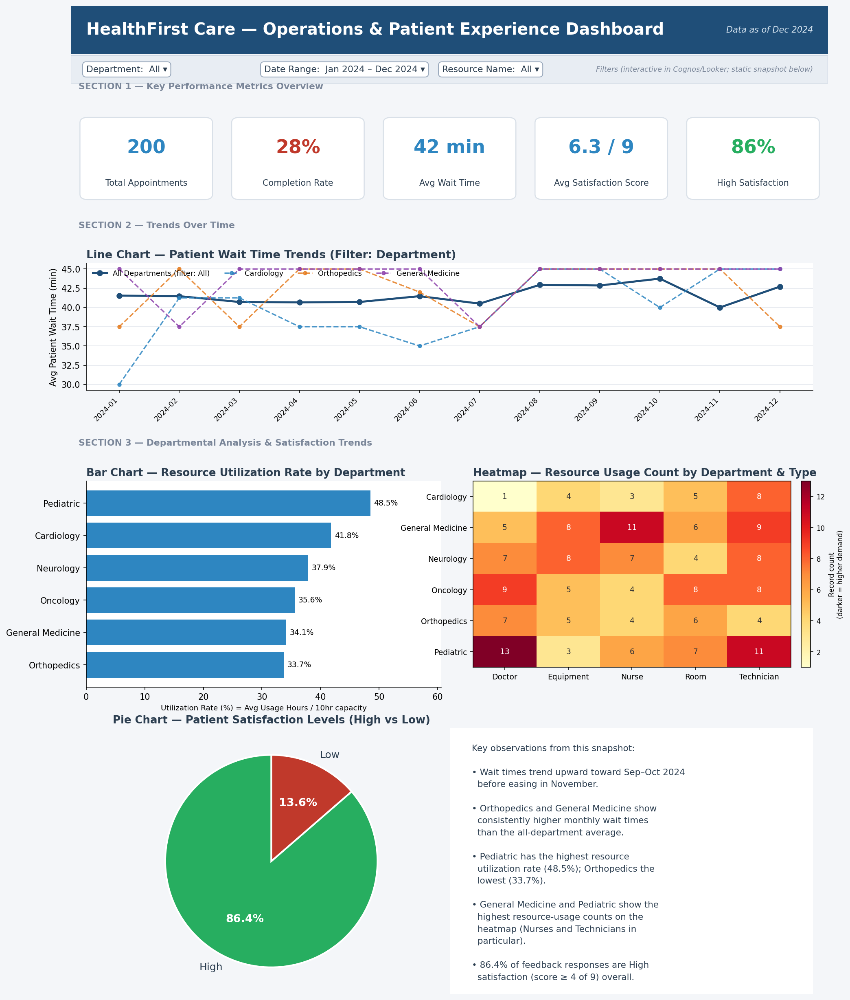
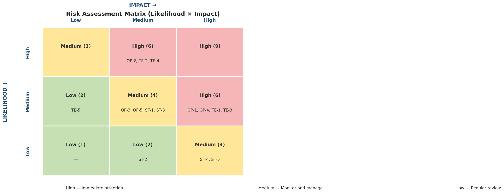
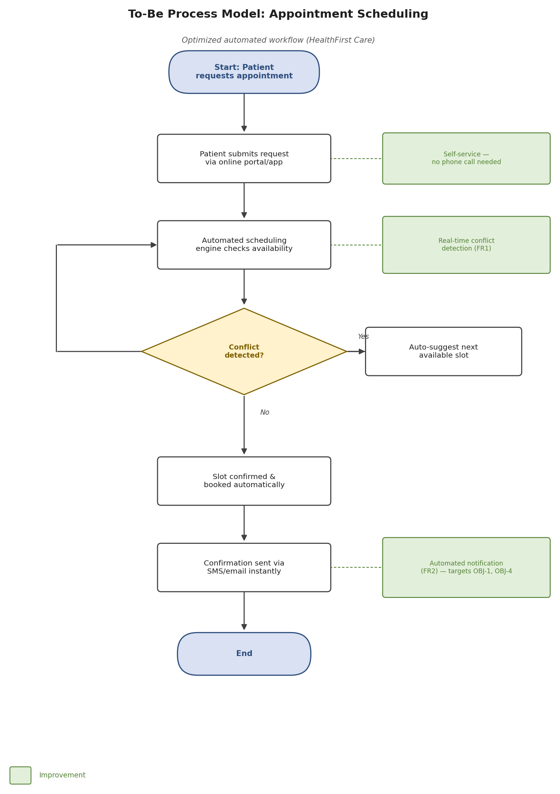
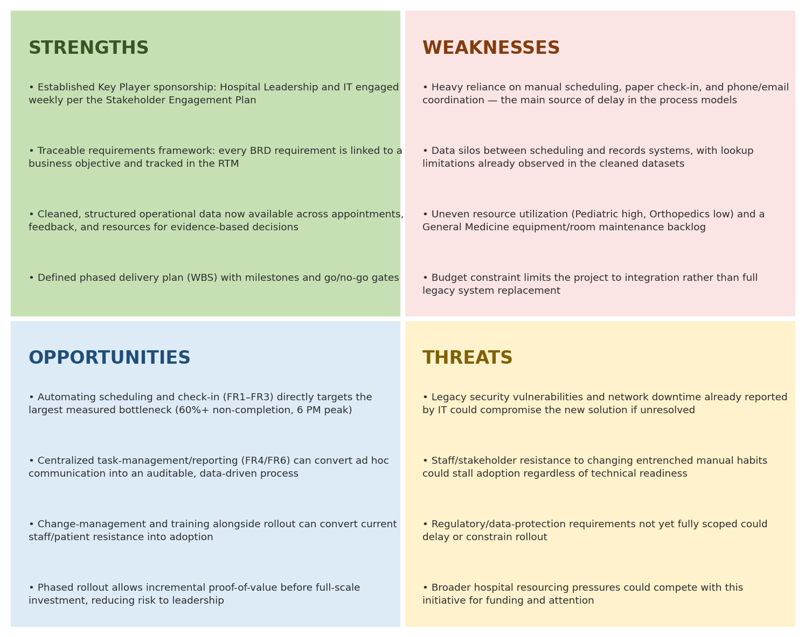

# HealthFirst Care — Operational Efficiency & Patient Experience Capstone

**Business Analysis capstone project** — a full lifecycle engagement for a fictional multi-specialty
hospital (*HealthFirst Care*) facing long patient wait times, inefficient resource allocation, and
inter-departmental communication gaps.

Working as the Business Analyst, this project takes the initiative from a raw problem statement
through requirements, stakeholder engagement, process redesign, data analysis, risk management,
and a final stakeholder-ready presentation — with every recommendation traceable back to a
specific requirement, data point, or identified risk.

**Author:** Sajjad Karimian
**Role simulated:** Business Analyst

---

## Highlights

<table>
<tr>
<td width="50%">

**Operational dashboard** — appointment, satisfaction, and resource-utilization KPIs built from
the cleaned operational datasets.

</td>
<td width="50%">

**Risk Assessment Matrix** — 15 identified risks scored by Likelihood × Impact, with 7 flagged
High-priority and carried through to a full mitigation and contingency plan.

</td>
</tr>
<tr>
<td></td>
<td></td>
</tr>
<tr>
<td width="50%">

**To-Be process redesign** — the appointment scheduling workflow re-engineered from a manual,
conflict-prone process into an automated one with real-time conflict detection.

</td>
<td width="50%">

**SWOT analysis** — strengths, weaknesses, opportunities, and threats grounded in the same
evidence base as the risk register, not a generic template.

</td>
</tr>
<tr>
<td></td>
<td></td>
</tr>
</table>

---

## Key findings

- **6:00 PM is the single busiest appointment hour** (27 appointments), well above every other
  slot — and only 28% of all appointments are marked *Completed*.
- **Orthopedics has the highest share of Low patient-satisfaction feedback (27.6%)**, despite
  having the *lowest* resource utilization rate (33.7%) — a process problem, not a capacity one.
- **General Medicine carries the heaviest equipment/room maintenance backlog**, while Pediatric
  and Oncology show the most staff/doctor unavailability — two distinct resource bottlenecks.
- Delays consistently **cluster at handoffs between roles** (Admin → IT, Nurses → Doctors) rather
  than within any single team's own workload.
- Of 15 identified project risks, **7 are High priority**, spanning Operational, Technical, and
  Stakeholder categories in roughly equal measure.

Full findings, recommendations, and conclusion are in the [Final Presentation](07-Final-Presentation/).

---

## Repository structure

Each stage of the engagement is documented as a standalone deliverable, in the order it was
produced:

```
HealthFirst-Care-Capstone/
├── README.md
├── assets/                                    (images used in this README)
│
├── 01-Requirements/
│   ├── BRD.pdf                                 Business Requirements Document
│   └── RTM.pdf                                 Requirements Traceability Matrix
│
├── 02-Stakeholder-Analysis/
│   └── Stakeholder_Engagement_Plan.pdf
│
├── 03-Scope-Management/
│   ├── Scope_Management_Plan.pdf
│   └── WBS.pdf                                 Work Breakdown Structure
│
├── 04-Process-Modeling/
│   ├── As-Is_To-Be_Process_Models.pdf
│   └── BPMN_Swimlane_Diagrams.pdf
│
├── 05-Data-Analysis-Dashboard/
│   ├── Data_Analysis_Document.pdf
│   └── Dashboard_Export.pdf
│
├── 06-Risk-Management/
│   ├── Risk_Register_and_SWOT.pdf
│   └── Risk_Matrix_and_Mitigation_Plan.pdf
│
└── 07-Final-Presentation/
    └── Final_Presentation.pdf                  Executive summary → conclusion, full lifecycle
```

| # | Stage | What it covers |
|---|-------|-----------------|
| 01 | **Requirements** | Problem statement, functional/non-functional requirements, MoSCoW prioritization, full 7-column traceability matrix |
| 02 | **Stakeholder Analysis** | Stakeholder map, influence levels, engagement and communication strategy per group |
| 03 | **Scope Management** | In/out of scope, assumptions, constraints, 8-phase WBS, change-management process |
| 04 | **Process Modeling** | As-Is vs. To-Be workflows, BPMN diagrams, swimlane diagrams by stakeholder responsibility |
| 05 | **Data Analysis & Dashboard** | Pivot-table trend analysis, KPI dashboard (wait times, utilization, satisfaction) |
| 06 | **Risk Management** | 15-risk register, Likelihood × Impact matrix, SWOT, 7 High-priority risks with mitigation + contingency plans |
| 07 | **Final Presentation** | End-to-end synthesis: executive summary, introduction, objectives, findings, recommendations, conclusion |

---

## How this was built

This project follows a standard BA lifecycle, with each stage's output feeding the next:

1. **Elicit** requirements from a stakeholder profile set and case study → BRD + RTM
2. **Map** stakeholders by influence and define engagement cadence
3. **Bound** the project — scope, assumptions, constraints, WBS
4. **Model** current vs. proposed workflows (As-Is/To-Be, BPMN, swimlane)
5. **Analyze** operational data (appointments, feedback, resources) → trends and KPIs
6. **Assess risk** across Operational, Technical, and Stakeholder categories, then mitigate
   the highest-priority ones with concrete contingency plans
7. **Synthesize** everything into a single stakeholder-ready presentation

## Tools used

- MS Word / Excel / PowerPoint for all deliverables
- Excel pivot tables and native charts for data analysis
- BPMN and swimlane notation for process modeling
- A 3×3 Likelihood × Impact risk matrix for risk prioritization

---

*This is a capstone training project built around a fictional hospital case study. All data
(appointment, feedback, and resource records) is synthetic, and stakeholder names are
illustrative.*
